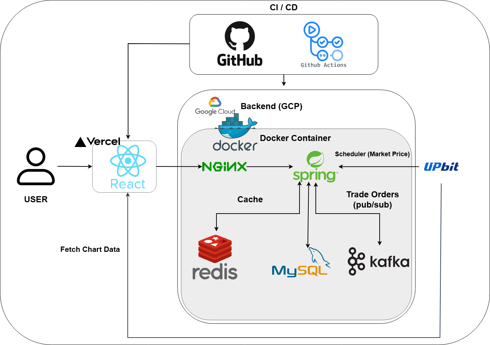

# 📈 실시간 대용량 가상 자산 거래 플랫폼 (Virtual Exchange)

👉 **[API 명세서 보러가기](https://dkrmddkrmd.github.io/virtual-exchange/)**

> **대규모 트래픽 상황에서도 안정적인 주문 처리를 보장하는 가상 자산 모의 투자 서비스입니다.**
> Upbit API를 활용한 실시간 시세 연동과 Kafka 기반의 비동기 주문 처리를 구현했습니다.

<br>

## 🛠 Tech Stack

| 분류 | 기술 스택                                               |
| :-- |:----------------------------------------------------|
| **Language** | Java 17                                             |
| **Framework** | Spring Boot 3.5.7, Spring Security, Spring Data JPA |
| **Database** | MySQL, Redis                                        |
| **Message Queue** | Apache Kafka                                        |
| **Infrastructure** | GCP (Compute Engine), Nginx, Docker, Docker Compose |
| **CI/CD** | GitHub Actions, Vercel                              |
| **Testing & Docs** | JUnit5, JMeter, Spring REST Docs, MockMvc           |
| **Tools** | IntelliJ, Git, Claude Code                          |

<br>

## 🏛 Architecture



* **Redis Caching & Lock:** 자주 조회되는 코인 시세 정보 캐싱(Look-aside) 및 분산 락을 통한 동시성 제어
* **Kafka Async Processing:** 주문 요청을 비동기 메시지로 발행하여 트래픽 병목을 해소하고 안정적인 처리 구조 구축
* **Nginx Reverse Proxy:** 백엔드 서버 전면에 배치하여 외부 직접 접근을 차단하고 SSL(HTTPS) 통신 처리로 보안 강화
* **Hybrid Deployment:** 프론트엔드(Vercel)와 백엔드(GCP)를 분리 배포하여 인프라 독립성과 운영 효율성 확보
* **CI/CD Pipeline:** GitHub Actions를 활용한 빌드·테스트 자동화 및 배포 프로세스 구축으로 안정적인 배포 환경 구성
* **Scale-out Consideration:** Docker 컨테이너 기반의 확장성을 고려한 독립적 환경 구성

<br>

## 🔥 Key Troubleshooting & Performance

### 1. 동시성 제어 및 대용량 트래픽 처리 (Redis → Kafka)
* **문제 상황:**
    * 초기에는 Redis 분산 락(Redisson)을 사용하여 동시성을 제어했으나, 동기 방식의 특성상 트래픽 급증 시 대기열 발생 및 응답 지연(Latency) 문제 확인.
    * JMeter 부하 테스트 결과, 평균 응답 시간 **6.7초** 소요.
* **해결 방안:**
    * **Kafka**를 도입하여 주문 처리를 **비동기(Event-Driven)** 방식으로 전환.
    * Kafka의 **Partition Key(UserId)** 전략을 사용하여, 사용자별 순서를 보장하면서도 별도의 락(Lock) 없이 데이터 정합성을 확보.
* **결과:**
    * 복잡한 락 로직을 제거하여 코드 복잡도 감소.
    * 평균 응답 시간 **0.5초**로 단축 (**약 92% 성능 개선**).
    * TPS(초당 처리량) **1,500+** 달성 및 안정성 검증 완료.

### 2. JPA N+1 문제 해결 및 쿼리 최적화
* **문제 상황:**
    * '내 자산 현황' 조회 시, 보유한 종목 개수(N)만큼 `Select` 쿼리가 추가로 발생하는 N+1 문제 발생.
* **해결 방안:**
    * `Fetch Join`을 적용하여 연관된 `Stock` 엔티티를 한 번의 쿼리로 함께 조회하도록 최적화.
* **결과:**
    * API 호출 당 쿼리 발생 횟수: **1 + N회 ➡ 1회**로 감소.

### 3. 대용량 거래 내역 조회 최적화 (인덱싱 및 페이징)
* **문제 상황:**
    * 사용자의 주문 내역(Order) 데이터가 누적될수록, '내 거래 내역 조회' 시 Full Table Scan이 발생하여 조회 응답 속도가 저하될 위험 존재.
* **해결 방안:**
    * 쿼리 조건으로 자주 사용되는 `user_id`와 정렬 기준이 되는 `order_date DESC` 컬럼에 **복합 인덱스(Composite Index)** 를 적용하여 검색 속도 개선.
    * Spring Data JPA의 `Pageable`을 활용하여 **페이징(Pagination)** 처리.
* **결과:**
    * 데이터가 수백만 건 이상으로 방대해져도 일정한 조회 속도를 보장하며, DB 서버의 메모리 및 네트워크 과부하 사전 차단.

### 4. 실시간 시세 조회 병목 개선 (Redis Caching)
* **문제 상황:**
    * '전체 코인 시세 조회'는 모든 유저가 가장 빈번하게 호출하는 핵심 API로, 트래픽 집중 시 DB 커넥션 고갈 및 응답 지연 발생 위험 존재.
* **해결 방안:**
    * **Look-aside 캐싱 패턴 적용:** 조회 빈도가 높은 시세 데이터를 Redis에 캐싱(`@Cacheable`)하여 DB 접근 최소화.
    * **데이터 정합성 보장:** 스케줄러를 통해 10초 주기로 Upbit API의 최신 시세를 DB에 갱신하고, 동시에 기존 캐시를 초기화(`@CacheEvict`)하여 사용자에게 항상 최신 가격 노출.
* **결과:**
    * 대규모 트래픽 발생 시에도 DB 부하를 원천 차단하고 초고속 조회 응답 속도 유지.

### 5. 인프라 보안 강화 및 SSL 인증 이슈 해결 (Nginx)
* **문제 상황:**
    * Vercel(HTTPS)과 GCP(HTTP) 간 통신 시 브라우저 보안 정책에 의한 **Mixed Content 오류** 발생.
* **해결 방안:**
    * GCP 인스턴스 전면에 **Nginx Reverse Proxy**를 구축하고 SSL 설정을 적용하여 모든 통신 구간을 HTTPS로 규격화.
* **결과:**
    * 실제 서버 IP/포트 은닉을 통한 보안성 강화 및 프론트-백엔드 간 원활한 데이터 통신 보장.

### 6. JWT 보안 강화 (Refresh Token + Rotation)
* **문제 상황:**
    * 기존 단일 Access Token 방식은 토큰 탈취 시 유효 시간 동안 무단 접근이 가능한 보안 취약점 존재.
* **해결 방안:**
    * Access Token(30분) + Refresh Token(7일) 분리 발급.
    * Refresh Token을 **Redis에 저장**하고 **HttpOnly 쿠키**로 전달하여 XSS 공격 방어.
    * **Rotation 방식** 도입 — 재발급 시마다 새 Refresh Token 발급 및 기존 토큰 즉시 무효화. 이미 사용된 토큰으로 재발급 시도 시 탈취로 간주하고 전체 세션 삭제.
* **결과:**
    * 토큰 탈취 시 즉각적인 감지 및 세션 무효화로 보안성 강화.

### 7. 이상 거래 탐지 시스템 구축 (AML)
* **문제 상황:**
    * 가상 자산 거래 플랫폼 특성상 시세 조작, 자금 세탁, 계정 탈취 등 이상 거래 패턴에 대한 탐지 및 대응 로직 부재.
* **해결 방안:**
    * **Redis Sorted Set 기반 Sliding Window** 구현 — 1분 내 5건 초과 주문 시 차단 (고정 윈도우 방식의 경계 취약점 해소).
    * 잔고 80% 이상 단일 매수, 심야(새벽 1~5시) 고액 거래, 1천만원 이상 거래 감지 시 **이메일 알림 발송** (`@Async` 비동기 처리로 주문 흐름 블로킹 방지).
    * 이상 거래 차단 시 실패 사유와 함께 **FAILED 상태로 거래 내역 DB 저장** — `@Transactional(noRollbackFor)` 적용으로 예외 발생 시에도 저장 보장.
* **결과:**
    * 다양한 이상 거래 패턴을 탐지하는 금융 보안 로직 구현.
    * 사용자가 거래 내역에서 차단 사유 직접 확인 가능.

<br>

## ✨ Key Features & Collaboration

* **API 문서 자동화 (Spring REST Docs):**
    * `MockMvc` 테스트를 통과한 검증된 API만 문서화되도록 파이프라인 구축.
    * 프론트엔드 개발자에게 신뢰할 수 있는 100% 정확한 API 명세서 제공.
* **중앙 집중식 예외 처리 (@RestControllerAdvice):**
    * 서버 에러 발생 시 클라이언트가 파싱하기 쉬운 일관된 포맷(상태 코드, 에러 메시지)으로 응답하도록 예외 처리 규격화.
* **실시간 시세 조회:** Upbit API 연동 및 WebClient/Scheduler를 통한 시세 동기화.
* **비동기 주문 처리:** 지정가/시장가 주문 지원 (Kafka 기반 처리).
* **보안(Security):** JWT 기반 인증/인가, Refresh Token Rotation, Spring Security Context 활용.

<br>

## 🧪 Testing (Stability)
* **Unit Test (Mockito):** 외부 의존성(DB, Redis, 이메일 서버 등)을 완벽히 격리하고 순수 비즈니스 로직에 집중한 단위 테스트 작성. RefreshTokenService, AbnormalTradeDetector, OrderTransactionService 등 핵심 서비스 검증.
* **API Documentation Test (MockMvc):** Controller 계층의 Request/Response 검증을 통과한 신뢰할 수 있는 API만 문서화(REST Docs)되도록 파이프라인 구축.
* **Integration Test (EmbeddedKafka):** `@EmbeddedKafka`를 활용하여 실제 Kafka 흐름을 타고 주문 처리 전체 흐름 검증.
* **JMeter Stress Test:** 1,000명 동시 접속, 총 10,000건 주문 요청 시 **Error 0%** 달성 및 성능 지표 검증.

<br>

## 🚢 CI/CD Pipeline
* **GitHub Actions 기반 자동화:** `main` 브랜치에 Push 발생 시 자동으로 빌드 및 테스트를 수행하고, **GCP(백엔드)와 Vercel(프론트엔드)**에 동시 배포되는 파이프라인을 구축했습니다.
* **배포 안정성 확보:** 테스트 코드(`JUnit 5`) 및 API 문서화 테스트가 통과된 시점에만 배포를 진행하여 운영 환경의 무결성을 보장합니다.

```text
[ GitHub ] ➡ [ GitHub Actions ] ➡ [ Build & Test ] ➡ [ GCP (Backend) / Vercel (Frontend) ]
```

## 🚀 How to Run
```bash
# 1. 프로젝트 클론
git clone https://github.com/dkrmddkrmd/virtual-exchange.git

# 2. Docker 실행 (Kafka, Redis, MySQL)
docker-compose up -d

# 3. 애플리케이션 실행
./gradlew bootRun
```